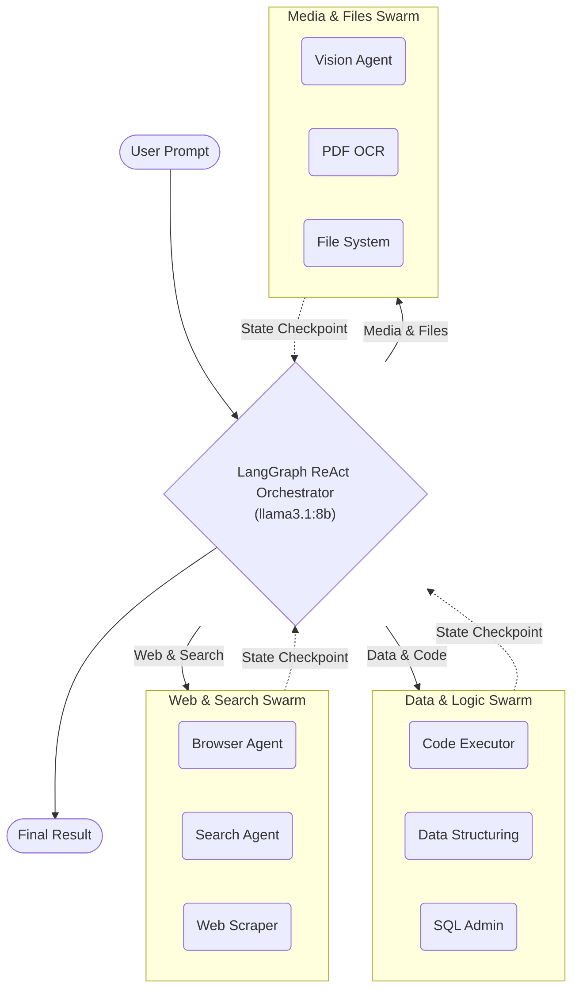

# Multi-Agent SLM Framework (V2)

[](https://www.python.org/downloads/)
[](https://ollama.com)
[](https://langchain-ai.github.io/langgraph/)
[](https://opensource.org/licenses/MIT)

A fully local, dynamic multi-agent system powered by Small Language Models (SLMs) running a **LangGraph ReAct orchestration loop**.

---

## What is this?

This is a resilient, dynamic multi-agent AI system designed to operate as an autonomous digital worker. Instead of relying on a single LLM to execute all workflows, this system uses a **LangGraph ReAct (Reason-Act) Orchestrator** to dynamically route tasks across a swarm of **35 highly-specialized AI Agents**. 

It can browse the web, write and execute code in sandboxes, search the internet, read PDFs, clone Git repositories, and structurally extract data—while autonomously self-correcting and recovering from execution errors using zero-dependency fallbacks.

---

## Architecture



---

## V2 Modernization Updates

This framework has been deeply modernized for stability and performance:
- **LangGraph Integration**: Migrated to stateful `create_react_agent` with in-memory checkpointing.
- **Dynamic Model Discovery**: Automatically detects installed Ollama models (`llama3.1`, `llama3.2`).
- **Resilient Fallbacks**: Zero-dependency fallbacks for `search_agent` (REST APIs), `browser_agent` (local Playwright), and `setup_guide_agent` (offline docs).
- **Diagnostics CLI**: Instant health checks via `python run.py --health`.

---

## Tech Stack

Our stack is built for speed, resilience, and maximum autonomy:

- **Core Orchestrator**: `llama3.1:8b` via Ollama + LangGraph
- **Sub-Agents**: `llama3.2:3b` via Ollama
- **Multimodal**: `llama3.2-vision` & `pypdf`
- **Cloud Fallback**: `gemini-3.1-flash-lite` via `langchain-google-genai`
- **Browser Automation**: `Playwright` Headless Chromium
- **Code Execution**: Secure local Python subprocesses
- **Finance**: `yahooquery` (with `yfinance` fallback)

---

## Step-by-Step Quick Start

### 1. Install Dependencies
Ensure you have Python 3.10+ installed.
```bash
python -m venv .venv
# Activate virtual environment
source .venv/bin/activate      # Mac/Linux
.\.venv\Scripts\Activate.ps1   # Windows

# Install required packages
pip install -r requirements.txt
playwright install
```

### 2. Start the Local AI Engine
Ensure you have [Ollama](https://ollama.com/) installed and running.
```bash
ollama serve
```

In a new terminal window, pull the required optimized models:
```bash
ollama pull llama3.1:8b        # The Main Orchestrator
ollama pull llama3.2:3b        # Fast Sub-Agents
ollama pull llama3.2-vision    # Vision Agent
```

### 3. Verify System Health
Run the built-in diagnostic tool to ensure your environment is fully operational:
```bash
python run.py --health
```

### 4. Run the Swarm!
The **only file you need to run** is `run.py`. 

```bash
# Start an interactive autonomous session:
python run.py

# Run a one-shot task:
python run.py "Find Python Jobs in Pune and compile a detailed CSV report."

# Premium Cloud Mode (Requires GOOGLE_API_KEY / GEMINI_API_KEY in .env)
python run.py --premium "Search for SpaceX news, write a python script to fetch the homepage, execute it locally, and summarize the result."
```

---

## The 35-Agent Ecosystem

Run `python run.py --list-agents` to see the full list of highly specialized agents in the registry.

| Category | Key Agents |
|---|---|
| **Web & Search** | `search_agent`, `browser_agent`, `web_scraper`, `batch_scraper_agent`, `link_extractor` |
| **Data & Logic** | `code_executor_agent`, `data_structuring_agent`, `sql_db_agent`, `qa_agent`, `sentiment_analysis` |
| **Media & Vision**| `vision_agent`, `pdf_ocr_agent`, `audio_transcription_agent` |
| **Operations** | `github_agent`, `file_system_agent`, `finance_agent`, `setup_guide_agent` |

---

## Testing

The repository includes a comprehensive `pytest` test suite covering agent initialization, fallbacks, and API resiliency.
```bash
pytest tests/
```

---

## Project Structure

```text
multi_agent_slm/
├── run.py                 ← Main CLI & Orchestrator
├── requirements.txt       ← Package dependencies
├── agents/                ← 35 Highly-specialized Swarm Tools
├── core/                  ← LangGraph ReAct Loop & Model integrations
├── docs/                  
│   └── agents/            ← Auto-Generated Setup Rulebooks
├── archive/               ← Outputs, scraped CSVs, and execution logs
└── tests/                 ← Pytest Verification Suites
```
